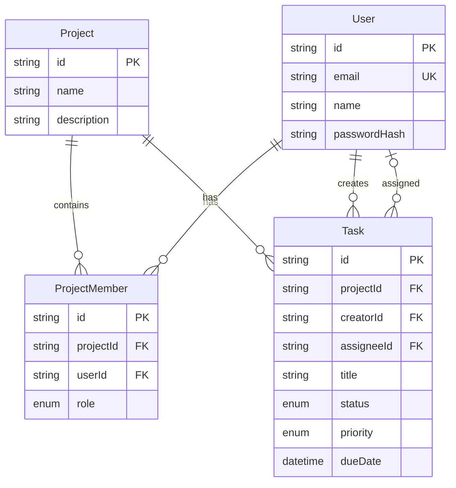

# Database Schema

PostgreSQL via Prisma ORM. The schema lives in `backend/prisma/schema.prisma`.

## Models

### User
Standard user table. Passwords stored as bcrypt hashes (10 rounds). Email is unique and lowercased on signup.

### Project
Just a name + optional description. The interesting part is that roles live on the join table, not here.

### ProjectMember
This is the key design choice - roles are **per-project**, not global. So the same user can be Admin in "Marketing Site" but just a Member in "Internal Tools". The `@@unique([projectId, userId])` constraint prevents duplicate memberships.

### Task
Belongs to a project. Has a creator (who made it) and an optional assignee (who's working on it). Status is a simple enum: TODO → IN_PROGRESS → DONE. I went with `onDelete: Cascade` on the project relation so deleting a project cleans up everything.

## Why These Choices

- **cuid() for IDs** - URL-safe, non-sequential (can't enumerate), no integer overflow concerns
- **Compound index on (projectId, status)** - the Kanban board queries by project + groups by status, so this index covers the most common read path
- **Separate dueDate index** - the dashboard queries overdue tasks across projects, needs to filter by date efficiently
- **No soft deletes** - kept it simple for the assessment. In prod I'd probably add a `deletedAt` column

## ER Diagram

